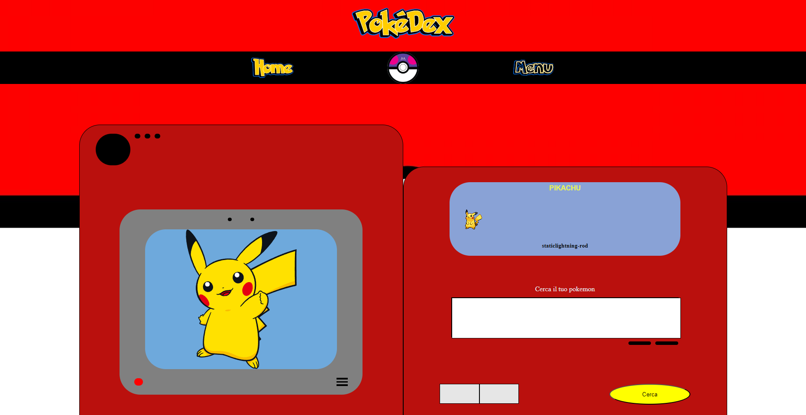
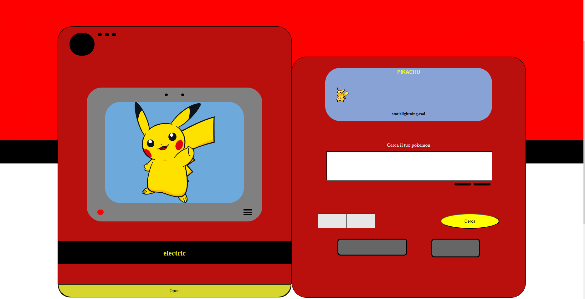
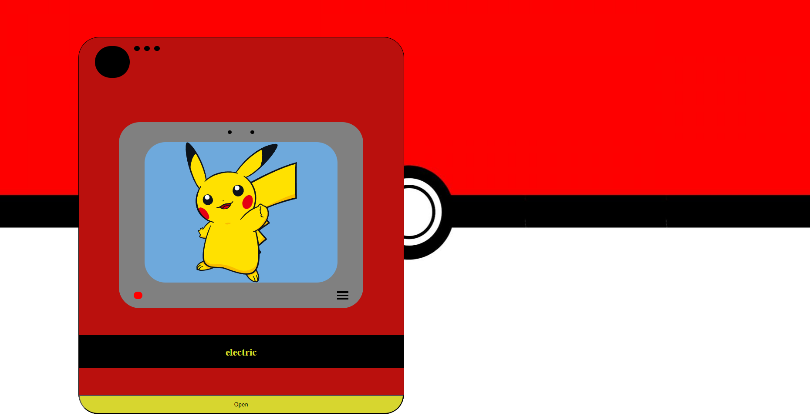
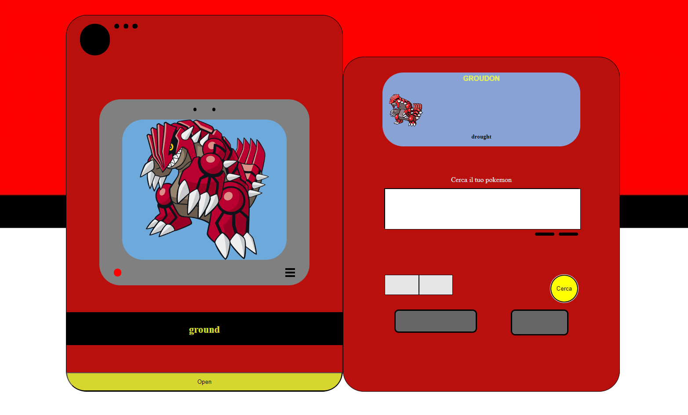
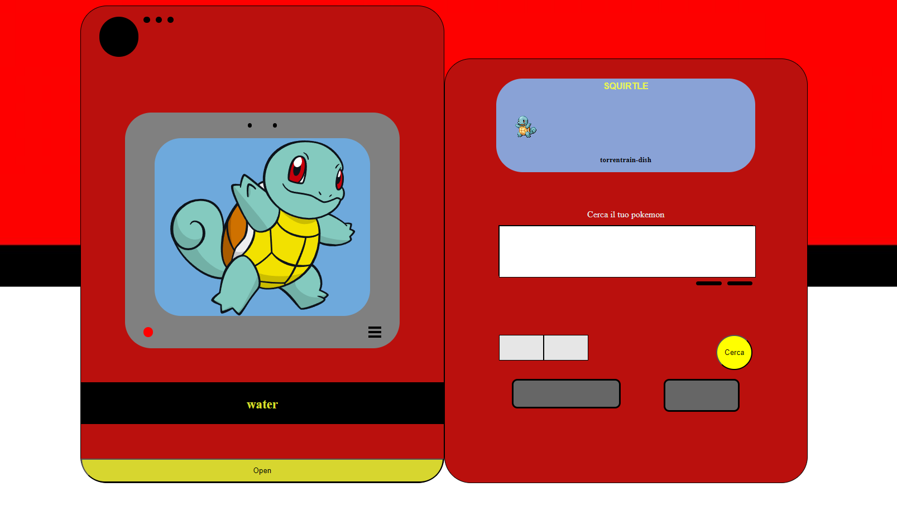
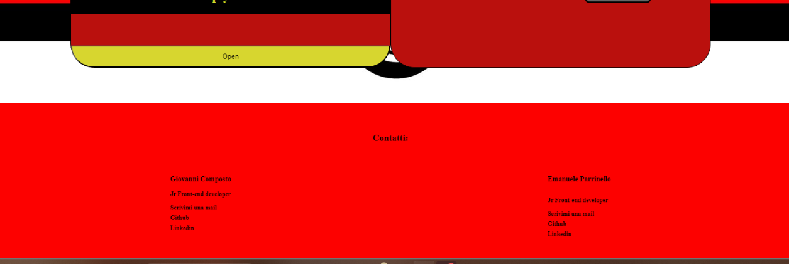

### Screenshot

### Built with

- Semantic HTML5 markup
- CSS custom properties
- Flexbox
- Mobile-first workflow
- React.js(JSX)
- useState and UseEffect
- Ternary Operators

**Have fun building!** 🚀